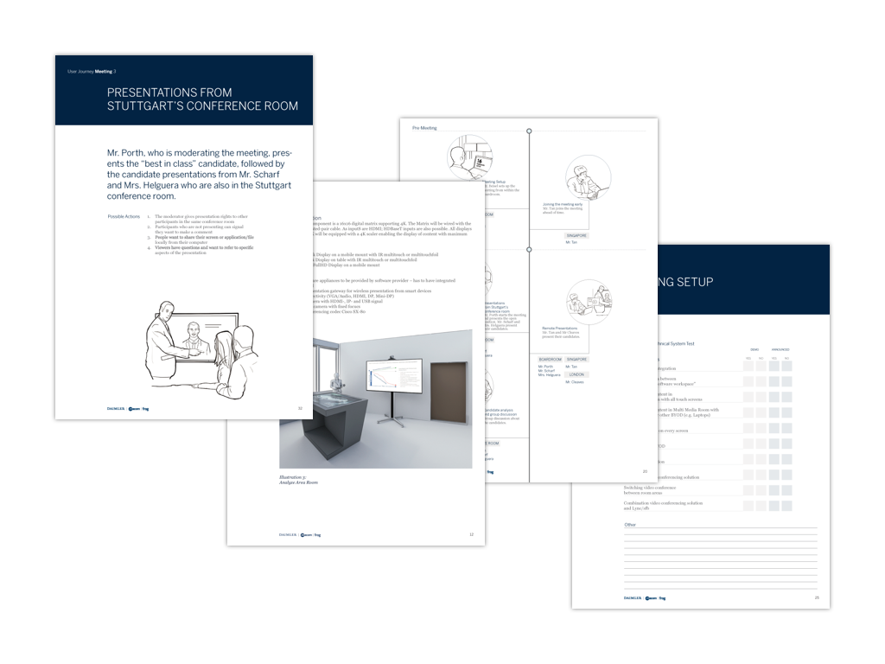

[Daimler](https://www.daimler.com/en/) was in the process of building out several new, state of the art conference room system for their executive board. They wanted to combine the best in breed hardware and software in a seamless user experience.

[frog](https://www.frogdesign.com/) was hired to help Daimler evaluate and pick a software partner to power a multi-screen, multi-purpose conference rooms that include remote participation.

In partnership with [macom](https://www.macom.de/en/), I developed a 60 page "Vendor Briefing" document to be used for evaluating software vendor solutions. Using the Vendor Briefing document and a mock conference room with the required hardware, each vendor would demonstrate the strengths and weaknesses of their software according to several user journey scenarios in a full day presentation. Following the vendor presentations, I lead the evaluation workshop to discuss the different software solutions and provided my recommendation.

### Activities & Deliverables

- facilitated a project kick-off and several client and stakeholder workshops
- wrote and provided creative direction for a 60 page Vendor Briefing document
- conducted 4 on-site software vendor evaluation at Daimler's AG Headquarters
- created a vendor evaluation criteria document
- organized and lead the vendor evaluation workshop

