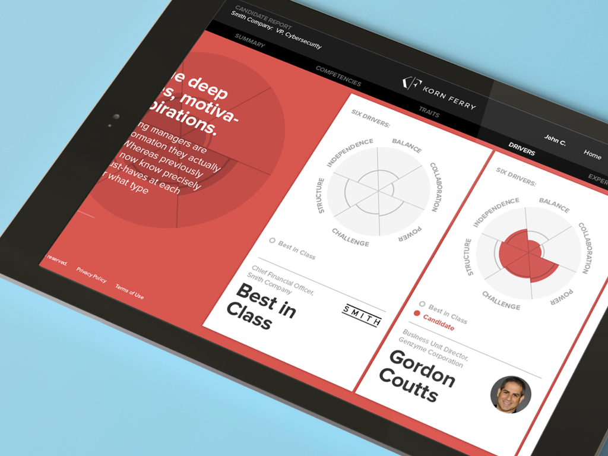
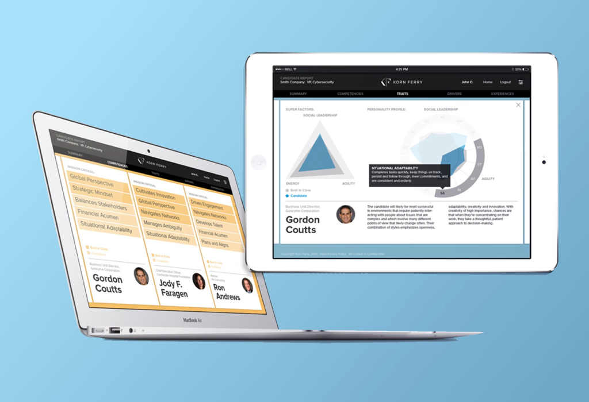

[Korn Ferry's](https://www.kornferry.com) is the world's largest executive search firm, providing recruitment and talent management at the most senior levels. [frog](https://www.frogdesign.com/) was hired to design a new suite of tools for clients, candidates, and consultants, making them a differentiator in sales and establishing a new digital design vocabulary to be used throughout the company.

From the beginning, I helped our design team with initial research, established design principles, simplified and redefined user flows. I then taught my team of developers React with the Flux architecture, which we used to develop a component library and build several web applications concurrently.

Korn Ferry's CTO was so pleased with the design and technical approach, he stopped and delayed many other initiatives to leverage our work. Later that year, my team's work won the HR Technology Conferences "Awesome New Technology" award for 2015.

### Activities & Deliverables

* helped facilitate stakeholder workshops
* advised on the UX and UI design
* taught my team React and the Flux architecture
* created a component library in React
* lead a team developing several single-page web apps concurrently using React
  and Flux

### More Info

* [Gian Leap Forward](https://www.kornferry.com/institute/giant-leap-forward)
* [Awesome New Technologies for HR
  Award](https://www.kornferry.com/press/awesome-new-technologies-for-hr-hr-tech-conference-selects-korn-ferrys-four-dimensional-executive-assessment/)

