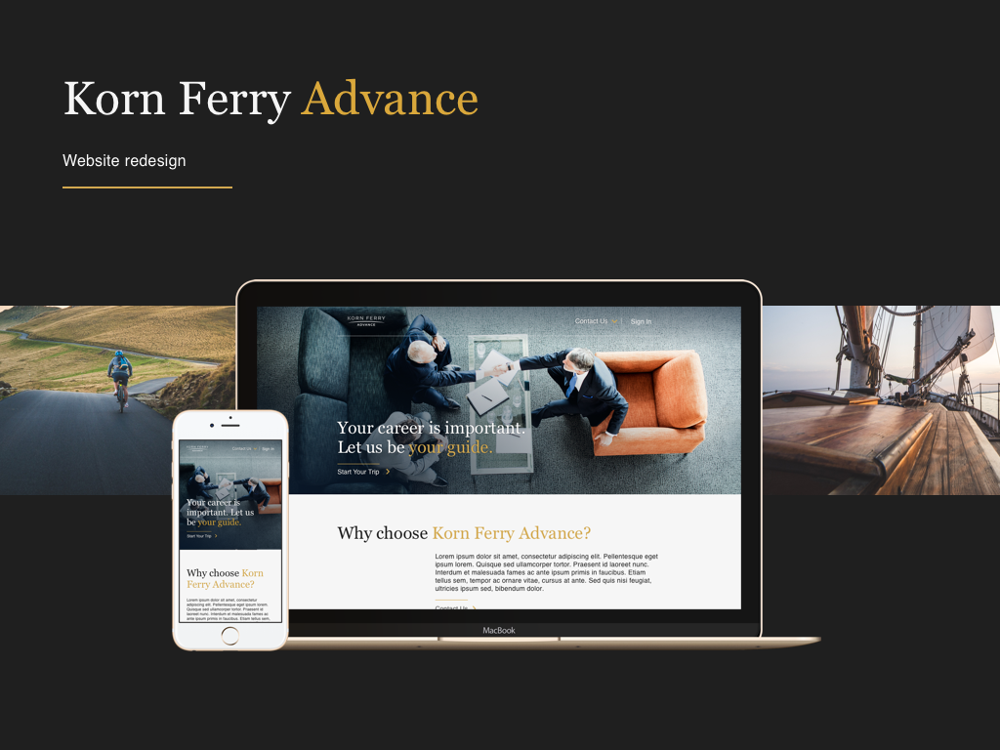
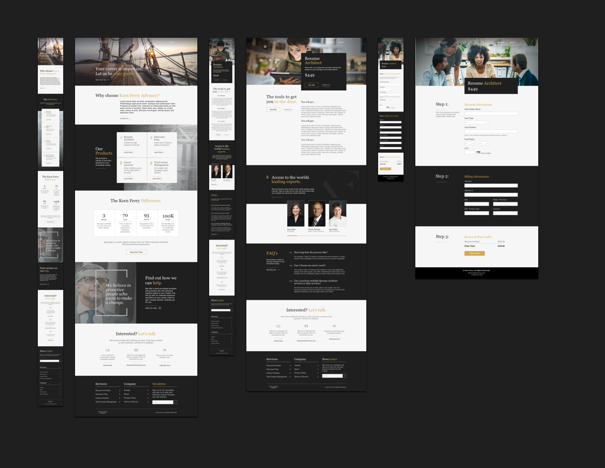
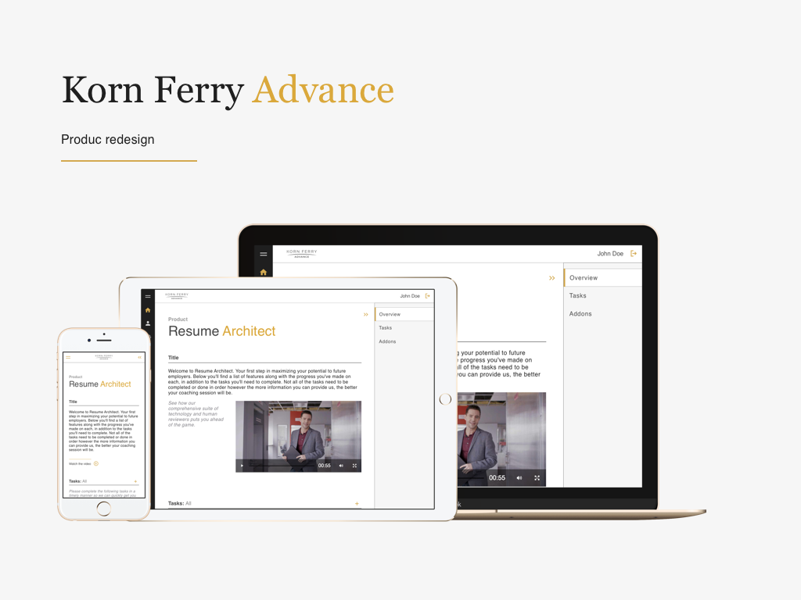
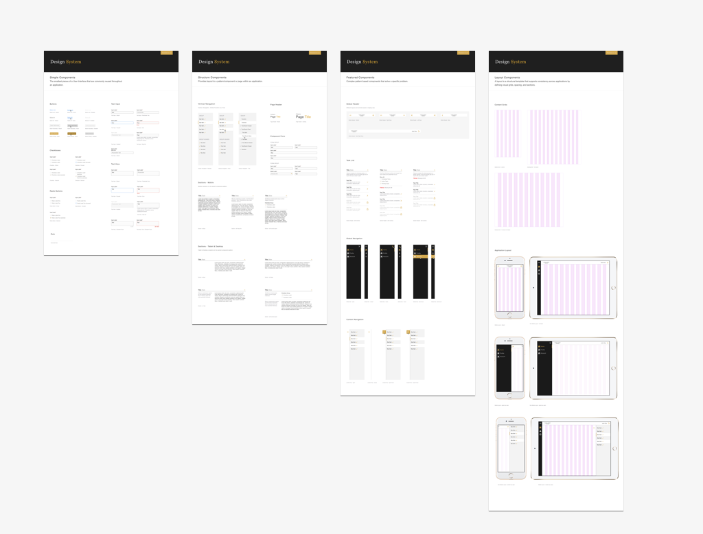
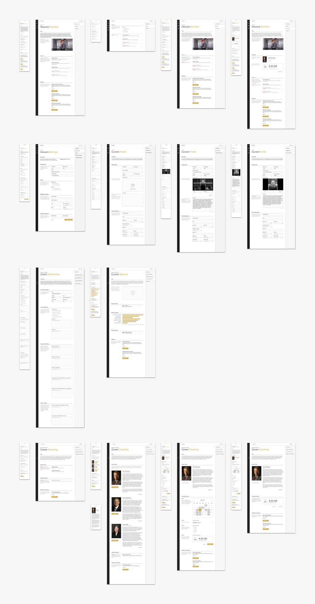

[KFAdvance](https://kfadvance.com/) is a product that connects individuals with [Korn Ferry's](https://www.kornferry.com) executive coaches to help them advance their career. These coaches can give targeted career advice, specifically tailored to their needs and situation, potentially forging an ongoing relationship that can last until retirement. I played a pivotal role on the team and contributing in multiple ways, from brand and execution, to UX and code.

My first challenge was to help them launch a pilot program of the product. The team was experiencing serious performance and velocity issues with their existing single-page website and needed help. I began by refactoring and updating their existing code base and build pipeline while teaching the team to use modern web technologies and best practices.

After successfully launching the pilot, I helped transform it into multiple products customers could purchase to accomplish specific tasks such as resume creation, interview coaching, salary negotiation and more. As part of this effort, I rebranded, designed and developed the product marketing pages, decoupling them from the existing code base. Not only did this give the product a new business model, it enabled us to iterate on the two independently.

Next, I focused my attention on changing the product from one that solved a specific need in time, to a platform that users would keep coming back to over the course of their career. I redesigned the product UI/UX while creating a design system and component library in code to support the implementation.

### Activities & Deliverables

* taught modern web technologies and best practices
* upgraded the initial web application from Angular 1.5.8 to Angular 1.6.3 to
  leverage a component based approach to UI development
* replaced Bower with NPM for dependency management
* replaced the Gulp build pipeline with Webpack and Babel
* redesigned the product marketing website and redeveloped it as a Progressive Web App (PWA) using React and the Next.js for better Search Engine Optimization (SEO) with Server Side Rendering (SSR)
* redesigned the product, created a design system using Sketch and a component
  library in React and Styled-JSX

