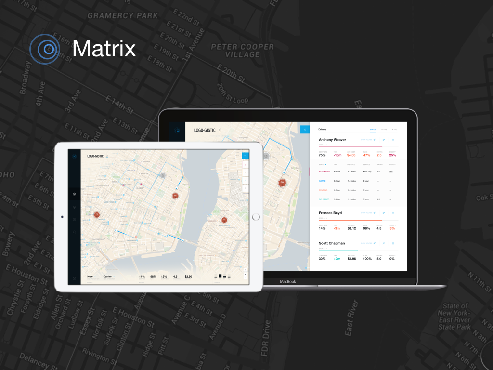
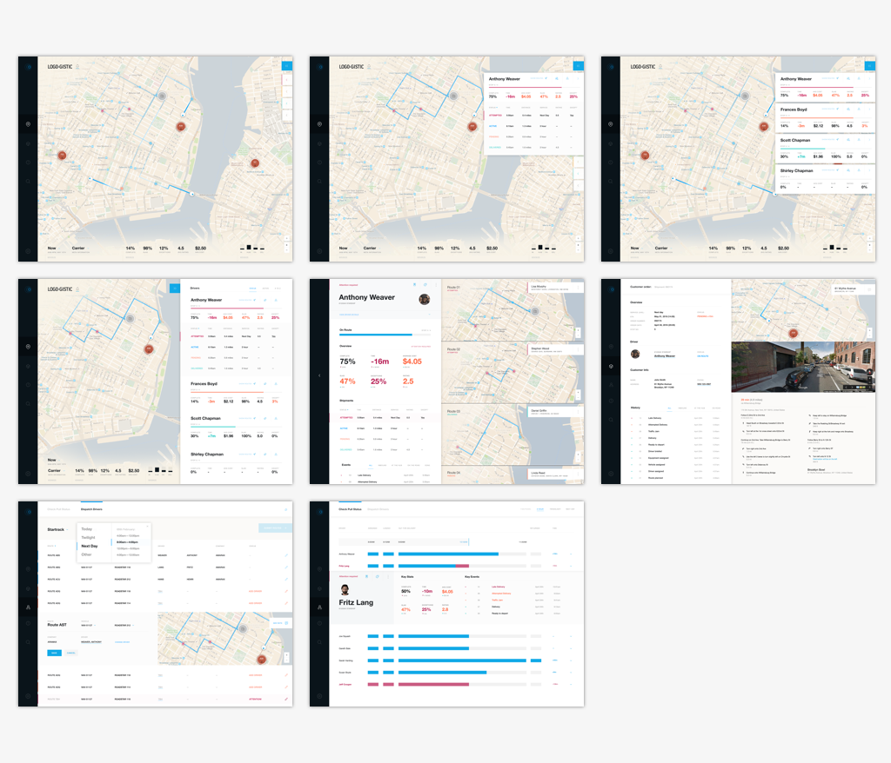

At [MileZero](https://www.milezero.com/) we built a Software as a Service (SaaS) in the transportation and logistics industry. The software focuses on the "middle mile" and "last mile" segments and coordinates same day services such as delivery, pickup, installation and etc.

As Head of Design, I designed and developed an application that gave Network and Fleet managers visibility into their workforce as they execute same-day tasks and services. Built on our own SaaS APIs, it provides real-world positioning and Key Performance Indicators (KPIs), as well as workflows for gracefully handling real-world unpredictability.

### Activities & Responsibilities

* conducted design research and a competitive analysis
* established the visual and UX design
* helped design the REST API's
* developed the web application with React, Redux, Redux-Saga and CSS Modules
* created a real-time mock server in Node.js and Express.js

