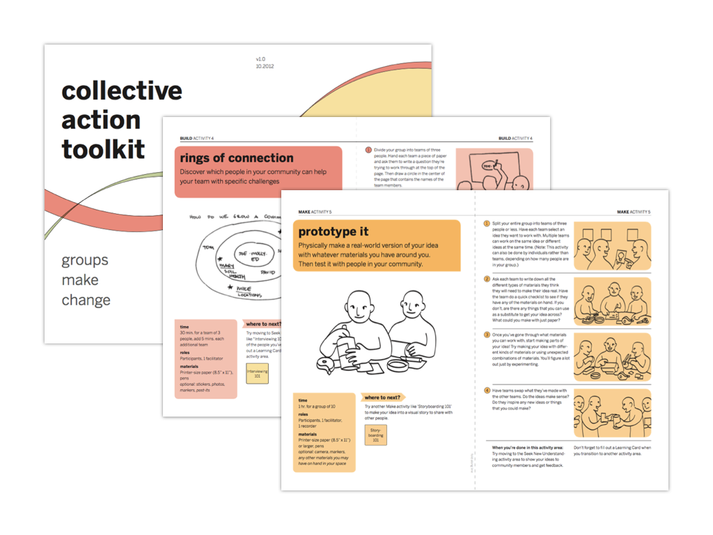

[The Girl Effect](https://www.girleffect.org/) and the [Nike Foundation ](https://news.nike.com/nike-foundation) asked [frog](https://www.frogdesign.com/) to explore ways of using Girl Direct to build a massive community of girls and mentors that can identify, access, demand, and receive the assets they need to survive and thrive.

Building on initial field research from an earlier phase, we created a Girl Club Analog Kit with modular activities around design thinking techniques and problem solving, enabling girls to co-design and co-create solutions for their community. We then piloted the Kit in 3 locations: Kenya, Ethiopia and Bangladesh. In each location we conducted a one week training session with female leaders on how to run a 6-week log co-design Girl Lab.

Based on the in-field observations, I created a mobile service prototype for connecting disparate girl groups, letting them share stories, learn, and request direct aid. We also continued to iterate on the Girl Club Analog Kit, which later became the [Collective Action Toolkit](https://www.frogdesign.com/work/frog-collective-action-toolkit).

### Activities & Deliverables

* conducted in-field design research in Africa and South East Asia
* trained local facilitators on how to use the Girl Club Analog Kit
* developed a mobile service prototype using Ruby and Twilio

### More Info

* [Nike – 100 Million
  Girls](https://www.frogdesign.com/portfolio/nike-foundation-girl-effect-100-million-girls)
* [The Girl Effect: The clock is
  ticking](https://www.youtube.com/watch?v=1e8xgF0JtVg)

